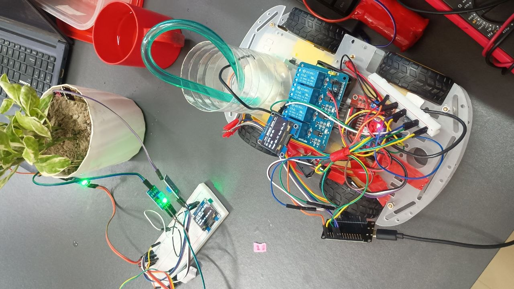
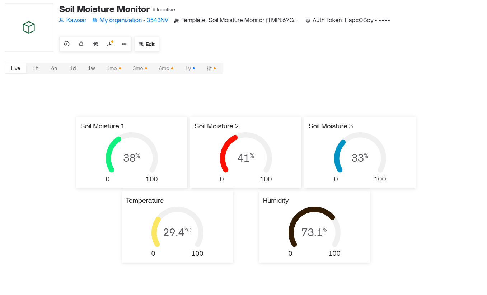
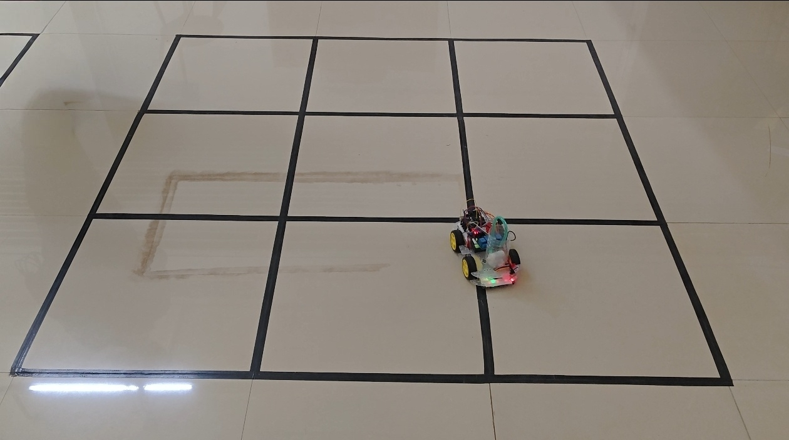

# Smart Agriculture and Automated Irrigation Management System

An IoT-driven smart irrigation system that monitors greenhouse conditions in real-time and automates plant watering using a line-following robot.


## Overview

This project presents a complete smart irrigation solution for greenhouse environments. The system combines ESP32 microcontrollers, Arduino Uno, IoT cloud monitoring (Blynk), and a PID-controlled line-following robot to deliver an automated, efficient, and organized watering system.

The system performs three major functions:

1. Real-time Environmental Monitoring: Tracks soil moisture, temperature, humidity, and light intensity
2. Cloud-based Data Visualization: Sends live data to the Blynk IoT mobile application via WiFi
3. Automated Irrigation: A robot navigates along predefined rows and waters plants automatically

### Hardware Setup



The assembled prototype showing the line-following robot vehicle with its mounted components, positioned next to the plant pot and the ESP32 monitoring station. All modules are connected and powered for testing.


### Live Sensor Data Dashboard



Real-time sensor data displayed on the Blynk IoT dashboard. The dashboard shows live soil moisture readings from all three sensors, air temperature, and humidity. Data updates every 2.5 seconds via WiFi.

### Line-Following Robot in Action



The robot vehicle navigating along the black line grid, which represents the predefined rows of plants in a greenhouse. The PID control algorithm keeps the vehicle centered on the line.

## Key Features

- Multi-Sensor Monitoring: 3x Capacitive Soil Moisture Sensors + DHT22 + LDR
- Real-time Cloud Dashboard: Live data on Blynk IoT mobile app
- Wireless Bluetooth Communication: ESP32-to-ESP32 data transfer
- OLED Display: On-vehicle real-time sensor readout
- PID Line-Following Algorithm: Smooth and accurate path tracking
- Automatic Water Pump Control: Relay-driven DC pump with timed cycles
- Modular Architecture: Independent monitoring and irrigation units

## Components Used

| # | Component | Quantity | Purpose |
|---|---|---|---|
| 1 | ESP32 NodeMCU | 2 | Master station + Vehicle receiver |
| 2 | Arduino Uno | 1 | Vehicle LFR + Pump controller |
| 3 | Capacitive Soil Moisture Sensor v1.2 | 3 | Soil moisture detection |
| 4 | DHT22 Temperature and Humidity Sensor | 1 | Air temperature + humidity |
| 5 | LDR Photosensitive Module | 1 | Light intensity |
| 6 | IR Line-Following Sensor | 5 | Line detection array |
| 7 | L298N Motor Driver | 1 | DC motor control |
| 8 | 5V Single-Channel Relay Module | 1 | Water pump switching |
| 9 | 3V-6V DC Submersible Water Pump | 1 | Irrigation |
| 10 | 4-Wheel Robot Chassis Kit | 1 | Vehicle platform |
| 11 | 0.96 inch I2C OLED Display (SSD1306) | 2 | On-vehicle display |
| 12 | 18650 Rechargeable Battery | 2 | Power source |


## Getting Started

### Prerequisites

- Arduino IDE (1.8.x or later)
- ESP32 Board Package (via Boards Manager)
- Arduino Uno Board (built-in)
- Required Libraries:
  - Blynk (for ESP32 cloud communication)
  - DHT sensor library (Adafruit)
  - Adafruit GFX Library
  - Adafruit SSD1306
  - BluetoothSerial (built-in with ESP32)

### Step 1: Setup Credentials

Copy the credentials template and fill in your details:

```
cp secrets/secrets.h.example secrets/secrets.h
```

Edit `secrets/secrets.h` and add:

```
#define BLYNK_TEMPLATE_ID   "***"
#define BLYNK_TEMPLATE_NAME "Soil Moisture Monitor"
#define BLYNK_AUTH_TOKEN    "***"

#define WIFI_SSID     "***"
#define WIFI_PASSWORD "***"
```

### Step 2: Upload ESP32 Master Station

1. Open `esp32_master_station/esp32_master_station.ino`
2. Select board: ESP32 Dev Module
3. Select correct COM port
4. Click Upload

### Step 3: Upload ESP32 Vehicle Receiver

1. Open `esp32_vehicle_receiver/esp32_vehicle_receiver.ino`
2. Select board: ESP32 Dev Module
3. Select correct COM port
4. Click Upload

### Step 4: Upload Arduino Uno Vehicle

1. Open `arduino_vehicle_lfr_pump/arduino_vehicle_lfr_pump.ino`
2. Select board: Arduino Uno
3. Select correct COM port
4. Click Upload

## Circuit Connections

### ESP32 Master Station

| Component | ESP32 GPIO |
|---|---|
| Soil Moisture Sensor 1 | GPIO 34 |
| Soil Moisture Sensor 2 | GPIO 35 |
| Soil Moisture Sensor 3 | GPIO 32 |
| DHT22 Data | GPIO 4 |
| LDR Analog | GPIO 33 |

### ESP32 Vehicle Receiver

| Component | ESP32 GPIO |
|---|---|
| OLED SDA | GPIO 21 |
| OLED SCL | GPIO 22 |

### Arduino Uno Vehicle

| Component | Arduino Pin |
|---|---|
| IR Sensor 1 (Leftmost) | D2 |
| IR Sensor 2 | D3 |
| IR Sensor 3 (Center) | D4 |
| IR Sensor 4 | D5 |
| IR Sensor 5 (Rightmost) | D6 |
| Relay Module | D7 |
| L298N IN1 | D8 |
| L298N IN2 | D9 |
| L298N IN3 | D10 |
| L298N IN4 | D11 |

## Blynk IoT Dashboard

The Blynk mobile app displays live data on virtual pins:

| Virtual Pin | Data |
|---|---|
| V0 | Soil Moisture Sensor 1 (%) |
| V3 | Soil Moisture Sensor 2 (%) |
| V4 | Soil Moisture Sensor 3 (%) |
| V1 | Temperature (C) |
| V2 | Air Humidity (%) |

Data updates every 2.5 seconds over WiFi.

## Bluetooth Communication Protocol

The ESP32 master station communicates with the vehicle receiver over Bluetooth Classic (SPP):

Device Names:
- Master: ESP32_Station
- Slave: ESP32_Vehicle

Data Format:

```
S,<soil1>,<soil2>,<soil3>,<temperature>,<humidity>,<light>\n
```

Example:

```
S,45,52,38,28.5,65,70
```

Data updates every 2 seconds.

## PID Line-Following Algorithm

The vehicle uses a 5-channel IR sensor array with a weighted average approach:

```
float weights[5] = {-2.0, -1.0, 0.0, 1.0, 2.0};
```

PID Parameters:
- Kp = 45.0 (Proportional)
- Ki = 0.0 (Integral)
- Kd = 25.0 (Derivative)
- Base Speed = 120
- Max Speed = 220

The algorithm calculates a correction value based on sensor deviation and adjusts motor speeds for smooth path tracking.

## Water Pump Control

The pump operates on a non-blocking millis()-based cycle:

- ON Time: 10 seconds
- OFF Time: 2 seconds
- Cycle: Continuous

This allows the vehicle to continue line-following while the pump runs in parallel.


